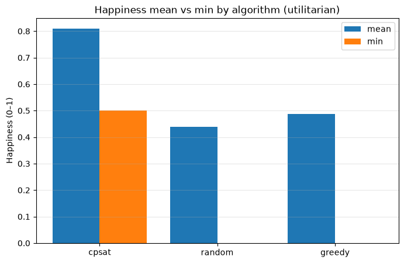
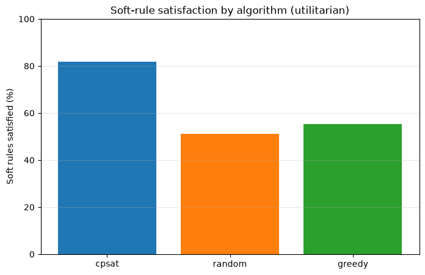
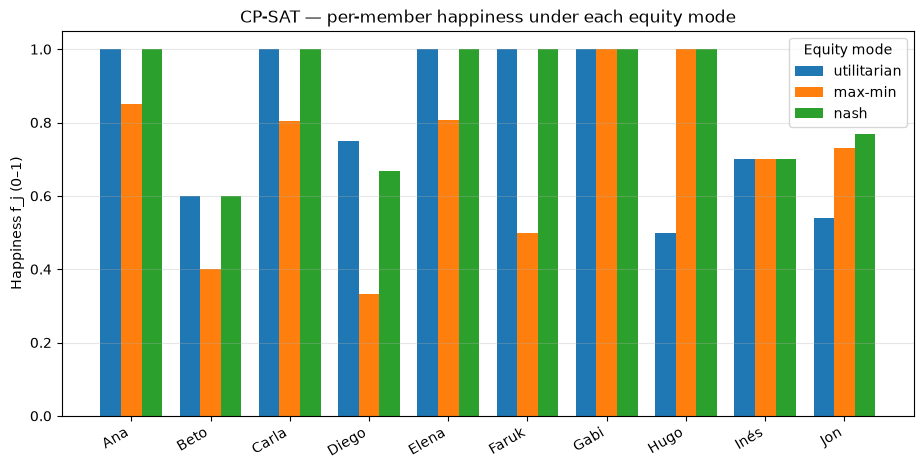

# Sprint 14 de Apollo — resultados

> Lectura cualitativa de los nueve planes (3 algoritmos × 3 modos de equidad)
> sobre la instancia [`case-study.json`](../../benchmarks/instances/case-study.json).
> Las cifras provienen de ejecutar el optimizer con `random_seed=0`; reejecutar
> reproduce estos valores. La felicidad `f_j ∈ [0,1]` es la fracción de reglas
> blandas de cada persona satisfecha, ponderada por peso (brief §7).

## 1. CP-SAT contra los baselines

Comparamos los tres algoritmos bajo el modo **utilitario** (suma total). Los
baselines `random` y `greedy` representan el tipo de reparto ad-hoc que sustituye
SprintWell.

| Algoritmo | Felicidad media | Felicidad mín | Reglas satisfechas | Tiempo |
|---|---|---|---|---|
| **CP-SAT** (exacto) | **0.81** | **0.50** | **81.8 %** | 90 ms |
| `greedy` | 0.49 | 0.00 | 55.2 % | < 1 ms |
| `random` | 0.44 | 0.00 | 51.0 % | 18 ms |

**Lectura.** CP-SAT casi duplica la felicidad media de los baselines (0.81 frente
a 0.44–0.49) y satisface ~30 puntos porcentuales más de reglas blandas. Lo más
importante para un equipo real es el **piso**: los dos baselines dejan al menos a
una persona en `0.0` —alguien cuyo sprint ignora por completo sus preferencias—,
mientras que CP-SAT garantiza un mínimo de `0.50`. El precio es tiempo de cómputo
(90 ms frente a casi nada), irrelevante a esta escala. Repartir a mano se parece
mucho más a los baselines que al óptimo.

## 2. El efecto del modo de equidad (CP-SAT)

La misma instancia, resuelta a óptimo bajo cada agregación de equidad (brief
§7.4):

| Modo | Felicidad media | Felicidad mín | Felicidad máx | Reglas satisfechas |
|---|---|---|---|---|
| `utilitarian` | 0.81 | 0.50 | 1.00 | 81.8 % |
| `max-min` | 0.71 | 0.33 | 1.00 | 74.0 % |
| **`nash`** | **0.87** | **0.60** | 1.00 | **87.5 %** |

Felicidad por persona bajo cada modo:

| Persona | utilitarian | max-min | nash |
|---|---|---|---|
| Ana   | 1.00 | 0.85 | 1.00 |
| Beto  | 0.60 | 0.40 | 0.60 |
| Carla | 1.00 | 0.80 | 1.00 |
| Diego | 0.75 | 0.33 | 0.67 |
| Elena | 1.00 | 0.81 | 1.00 |
| Faruk | 1.00 | 0.50 | 1.00 |
| Gabi  | 1.00 | 1.00 | 1.00 |
| **Hugo**  | **0.50** | **1.00** | **1.00** |
| Inés  | 0.70 | 0.70 | 0.70 |
| Jon   | 0.54 | 0.73 | 0.77 |

## 3. Qué significa para personas concretas

- **Hugo, el junior.** Bajo `utilitarian` queda en el piso (`0.50`): el modelo no
  pierde nada del total dejándolo sin sus tareas de aprendizaje, así que no lo
  prioriza. En cuanto la equidad entra en juego (`max-min` y `nash`), su deseo de
  crecer hacia `devops` —vía la regla `learn-skill`, que relaja la barrera de
  skill— se respeta y sube a `1.00`. Es el caso de uso que justifica los modos de
  equidad: proteger a quien el agregado dejaría atrás.
- **Jon** mejora monótonamente al pasar de utilitario (`0.54`) a Nash (`0.77`):
  rebalancear hacia los peor servidos lo favorece.
- **Diego, de guardia.** Se mantiene en la franja media (`0.67`–`0.75`) porque su
  ausencia dura del 12/05 y su preferencia por `infra` compiten por los mismos
  días. Su caída a `0.33` bajo `max-min` se explica en la siguiente sección.

## 4. Una sutileza honesta sobre `max-min`

A primera vista sorprende que `max-min` muestre la **media más baja** (0.71) y un
**piso normalizado (0.33) por debajo del de utilitario (0.50)** — lo contrario de
lo que sugiere su nombre. No es un error de medición, sino una distinción de
modelado que conviene declarar:

- La felicidad reportada es **normalizada**: `f_j = Σ_r (w_r · c_r) / Σ_r w_r`,
  es decir, la fracción ponderada de las reglas *de esa persona*.
- El objetivo de equidad (`max-min`, `nash`) opera sobre los términos
  **absolutos** `Σ_r (w_r · c_r)`, sin dividir por el peso total de cada persona.

Cuando los miembros cargan pesos totales distintos, "levantar el peor término
absoluto" no equivale a "levantar el peor `f_j` normalizado". `max-min` sí
maximiza al peor servido **en las unidades internas del modelo**, pero eso puede
redistribuir el índice mostrado hacia otras personas (aquí, hundiendo a Diego en
términos normalizados mientras dispara a Hugo a `1.00`). Es un candidato claro de
trabajo futuro: normalizar los términos de equidad para que el objetivo y el
índice reportado se muevan al unísono.

## 5. Conclusión

Para Apollo, **Nash es el modo por defecto recomendado**: en este sprint logró a
la vez la mayor felicidad media (0.87), el piso más alto (0.60) y la mayor
satisfacción de reglas (87.5 %) — equilibra sin sacrificar el agregado. El modo
`utilitarian` sirve cuando solo importa el rendimiento bruto, y `max-min` debe
leerse con la salvedad de la sección 4. En cualquiera de los tres, el plan exacto
de SprintWell domina con holgura al reparto ad-hoc que representan los baselines,
y lo hace en decenas de milisegundos: barato de adoptar, medible y defendible.

> **Reproducir.** Regenerar la instancia y las figuras: ver
> [`team.md`](./team.md) para la composición del equipo y
> [`benchmarks/notebooks/README.md`](../../benchmarks/notebooks/README.md) para la
> pila de análisis. Las figuras de este caso se generan corriendo el optimizer
> sobre `case-study.json` con los tres algoritmos y modos.
